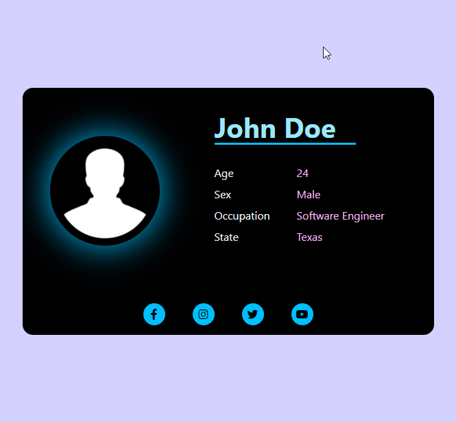

# React Social Card

This is project is a part of my **React Marathon**. I am doing 6 react projects using some instructions given [this blog](https://daveceddia.com/react-practice-projects/). This blog has given out 6 React Projects ideas to fallow and improve skills.

This is the second React App I selected from those six.

## This is a social card made with just React no Redux

### Features of this App

- Passing down custom type objects

I think this is kind of a _React_ App with a minimal complexity. This app has no state but still React is higher demand in these kind of apps. Reason is reusable components.

Components are devided in several ways and some are used again and again with different properties.

A custom type called `User` is used to represent a user. Users created in main `App` component and passed to `SocialCard` components.

I prefer adding styles in `scss` files. So I have added one to this project. All the styles are in `index.scss` file.
